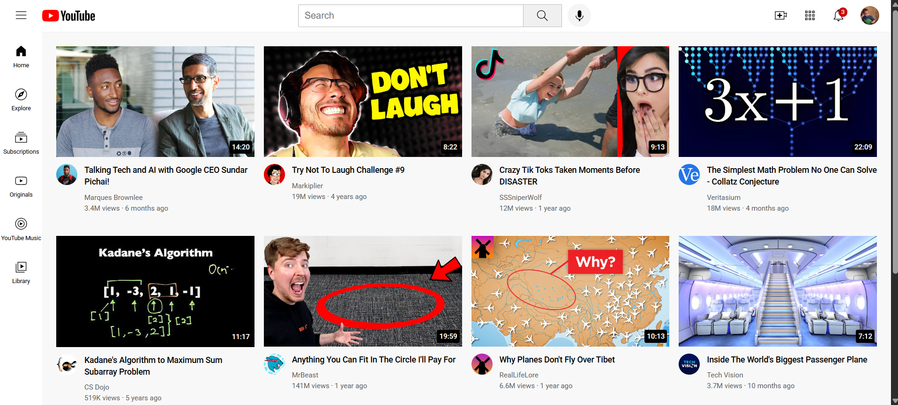

# YouTube Clone (HTML & CSS)

> **Note:** This project was built in December 12th 2024 as my first web project after learning HTML and CSS. It is a static landing page that mimics YouTube’s interface.

## Project Overview

This project is a **YouTube clone landing page** built entirely with **HTML and CSS**. It includes:  

- A **header** with a logo, a search bar and navigation elements  
- A **sidebar** for categories  
- A **videos grid** displaying video thumbnails  
- A fully **responsive layout** that works on different screen sizes  

This project helped me practice **HTML structure, CSS styling, and responsive web design**.

## Folder Structure

Youtube-project/

│

├── channel_pictures/ # Images for channel avatars

├── icons/ # Icons used in the UI

├── styles/ # CSS files

├── thumbnails/ # Video thumbnail images

└── youtube.html # Main HTML file

## Features

- Responsive grid layout for videos  
- Sidebar navigation menu  
- Clean and modern design inspired by YouTube  
- Fully static HTML & CSS (no JavaScript)  

## How to View

1. Clone this repository:  
   git clone https://github.com/Mhenni12/Youtube_project

2. Open youtube.html in your web browser

## Technologies Used

HTML5 – for the structure of the page

CSS3 – for styling, layout, and responsiveness

Flexbox & Grid – for arranging content
